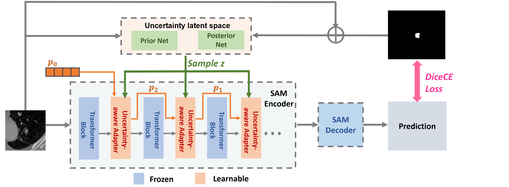

# Uncertainty-Aware Adapter: Adapting Segment Anything Model (SAM) for Ambiguous Medical Image Segmentation
UA-SAM, is a project to finetune SAM with Uncertainty-aware Adapter for ambiguous medical image segmentation. We use probabilistic sampling to help SAM make reliable and diverse segmentations. It is a multi-rater method, elaborated on the paper [Uncertainty-Aware Adapter: Adapting Segment Anything Model (SAM) for Ambiguous Medical Image Segmentation](https://arxiv.org/abs/2403.10931)
## A Quick Overview

## Datasets
1.REFUGE2 benchmark: you can access and download it in [here](https://refuge.grand-challenge.org/) or by [hugging face](https://huggingface.co/datasets/realslimman/REFUGE-MultiRater).

2.LIDC-IDRI benchmark: the original dataset can be found by [link](https://wiki.cancerimagingarchive.net/). We use the version [preprocessed](https://github.com/stefanknegt/Probabilistic-Unet-Pytorch), which you can download it in [here](https://drive.google.com/drive/folders/1xKfKCQo8qa6SAr3u7qWNtQjIphIrvmd5).

3.QUBIQ benchmark: the formal web link is [here](https://qubiq.grand-challenge.org/participation/).

## Codes

### Requirements
```bash
pip install -r requirement.txt
```
### Run UA-SAM codes
It is simple to run UA-SAM with default setting. You need to donwload the [SAM checkpoint](https://github.com/facebookresearch/segment-anything) to the `./pretrain`. Point prompt for training and you can change the type of prompt when testing. 

train:
```bash
python main.py --mode train --dataset refuge --dataset_path ./dataset/your_dataset_path --prompt_type point
```
test:
```bash
python main.py --mode val --dataset refuge --dataset_path ./dataset/your_dataset_path --prompt_type box
```
```bash
python main.py --mode val --dataset refuge --dataset_path ./dataset/your_dataset_path --prompt_type point
```
## Cite
If you find this code useful in your research, please consider citing our paper:
```
@article{jiang2024uncertainty,
  title={Uncertainty-Aware Adapter: Adapting Segment Anything Model (SAM) for Ambiguous Medical Image Segmentation},
  author={Jiang, Mingzhou and Zhou, Jiaying and Wu, Junde and Wang, Tianyang and Jin, Yueming and Xu, Min},
  journal={arXiv preprint arXiv:2403.10931},
  year={2024}
}
```
